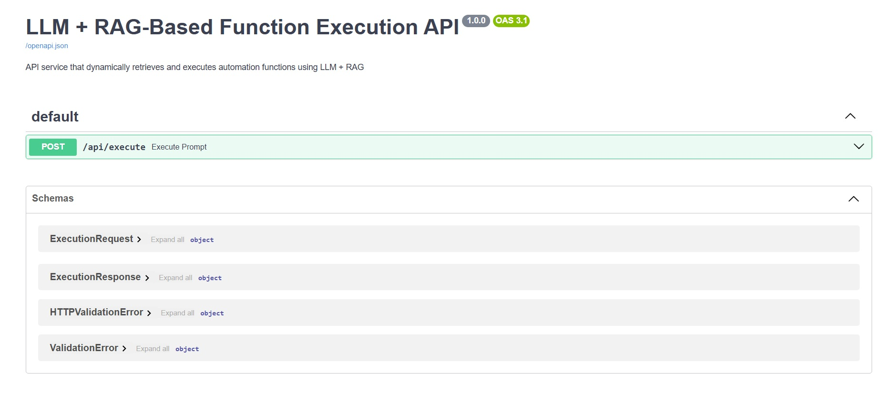
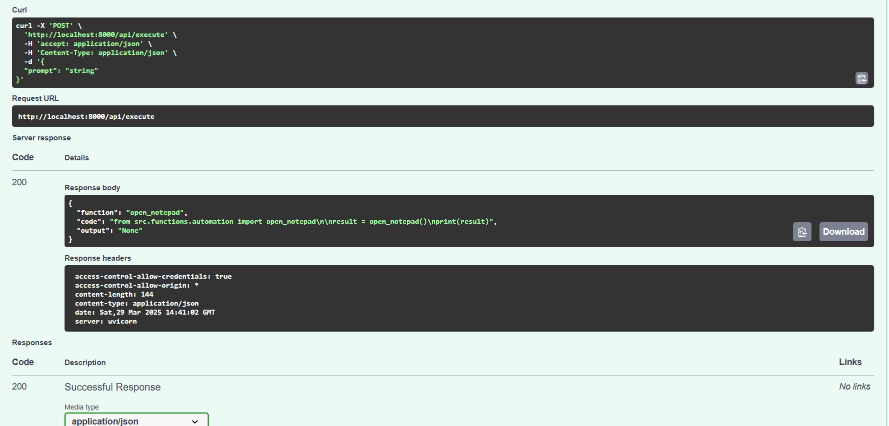
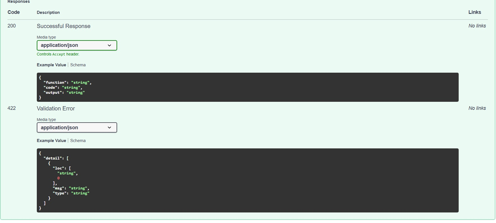

# Documentation Guide

## How to Take and Add Screenshots

Follow these steps to capture and add screenshots to the documentation:

### 1. Taking Screenshots

#### For FastAPI Swagger UI:
1. Make sure your FastAPI server is running at http://127.0.0.1:8000/docs
2. Press `Windows + Shift + S` to open Windows Snipping Tool
3. Select the area you want to capture
4. The screenshot will be automatically copied to your clipboard

#### For Postman:
1. Open Postman and set up your request
2. Make the API request
3. Use `Windows + Shift + S` to capture:
   - The request configuration
   - The response section

### 2. Saving Screenshots

1. After capturing the screenshot:
   - Open Paint or any image editor (Press `Windows + R`, type `mspaint`, press Enter)
   - Press `Ctrl + V` to paste the screenshot
   - Click File → Save as
   - Choose PNG format
   - Save in the 'screenshots' folder with a descriptive name (e.g., `swagger_cpu_usage.png`)

### 3. Adding Screenshots to Documentation

1. Create a 'screenshots' folder in your project root if it doesn't exist
2. Save your screenshots there with descriptive names
3. In the documentation file, add the screenshots using Markdown syntax:
   ```markdown
   
   ```

### Screenshots:

Here are the screenshots demonstrating the API functionality:


*Screenshot 1: Overview of the API endpoints in FastAPI Swagger UI*


*Screenshot 2: Example of making an API request with parameters*


*Screenshot 3: Sample API response showing the output format*

### Tips:
- Use descriptive file names for screenshots
- Keep screenshots focused on relevant information
- Ensure good image quality and readability
- Maintain consistent image dimensions when possible